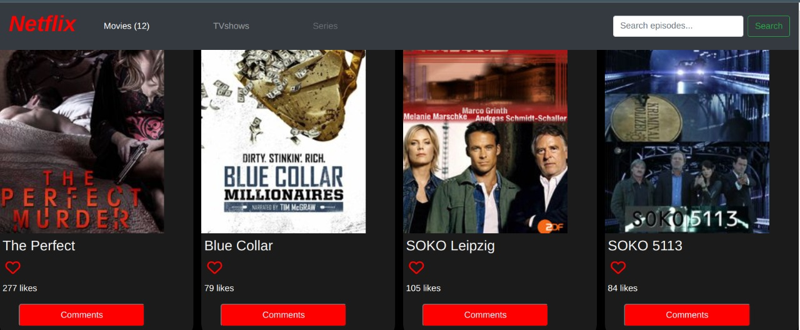

# MovieMaze Application

> This is a Microverse project that entails a movie website where a user can add a like to a movie and or comment as well.

# Preview

## Built With

- HTML
- CSS
- Javascript
- Jest 
- Webpack
- VS code

## Live Demo 

[Live Demo Link](https://tingamapuro04.github.io/JavaScript-KanBan-Project/)
[Netlify Link](movie-maze.netlify.app)

## Getting Started

- Inorder to be able to set this up locally and eventually run it, follow the steps;

- Open your Gitbash or your code editor's terminal and run the command git clone git@github.com:tingamapuro04/JavaScript-KanBan-Project.git
- Then you can pull the work from github to ur local machine using the git pull command.
- run npm install to install all dependencies used in the project
- run npm start to start the application on the browser.

## Test unit

- Install jest using the command <code>$ npm install --save-dev jest</code>
- You can check for more information here <a href="https://jestjs.io/">jest version</a>
- Add this to package.json :
  - "scripts": {
     - "test": "jest"
  - }
- run <code>npm test</code>

## Authors

👤 **Author**

- GitHub: [Christabelle143](https://github.com/Christabelle143)
- Twitter: [@christabelleyo](https://twitter.com/christabelleyo)
- LinkedIn: [YoutaChristabelle](https://linkedin.com/in/YoutaChristabelle)

👤 **Author**

- GitHub: [tingamapuro04](https://github.com/tingamapuro04)
- Twitter: [@alphonce_mobutu](https://twitter.com/alphonce_mobutu)
- LinkedIn: [adoyo-alphonce-3362a4173/](https://www.linkedin.com/in/adoyo-alphonce-3362a4173/)

## 🤝 Contributing

Contributions, issues, and feature requests are welcome!

## Show your support

Give a ⭐️ if you like this project!

## Acknowledgments

- Hat tip to anyone whose code was used
- Inspiration
- etc

## 📝 License

This project is [MIT](./MIT.md) licensed.
